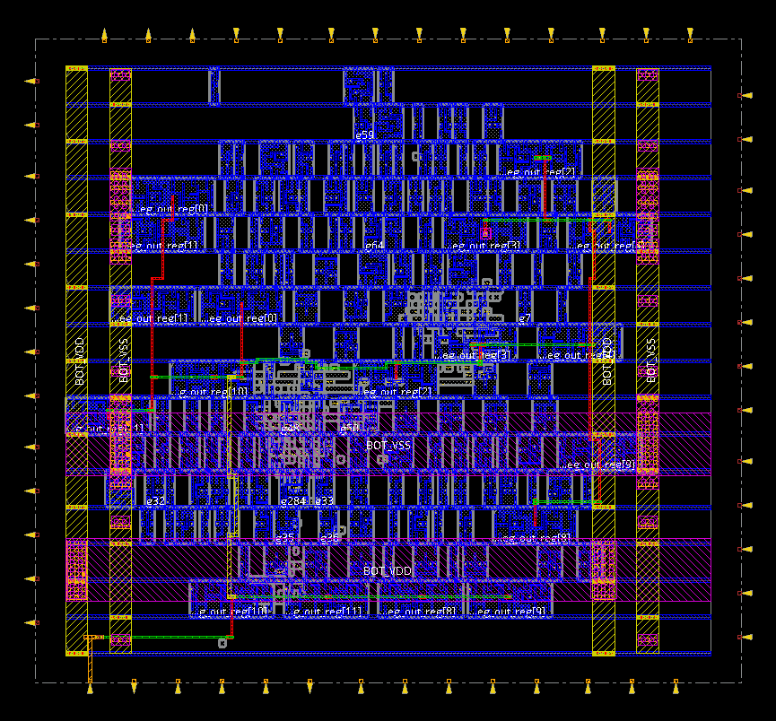
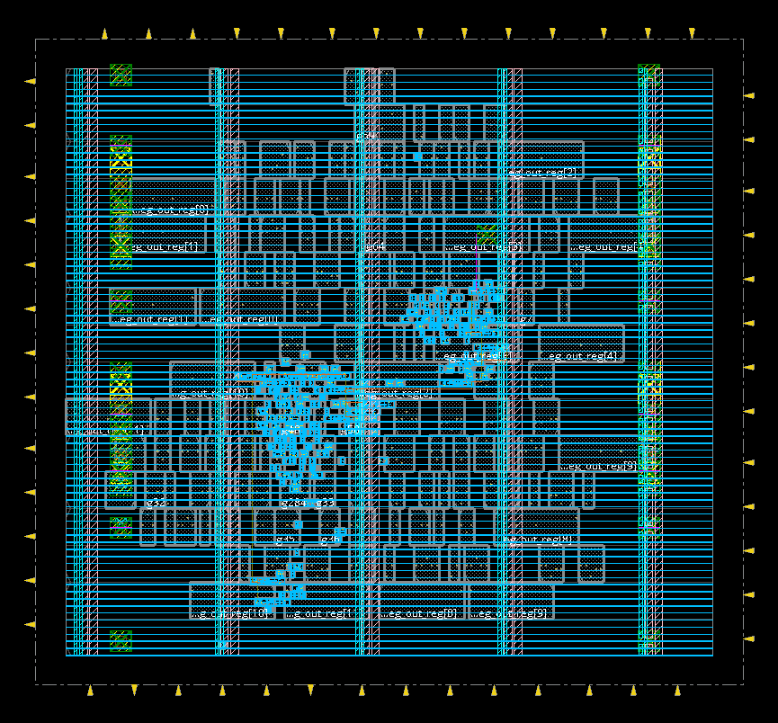
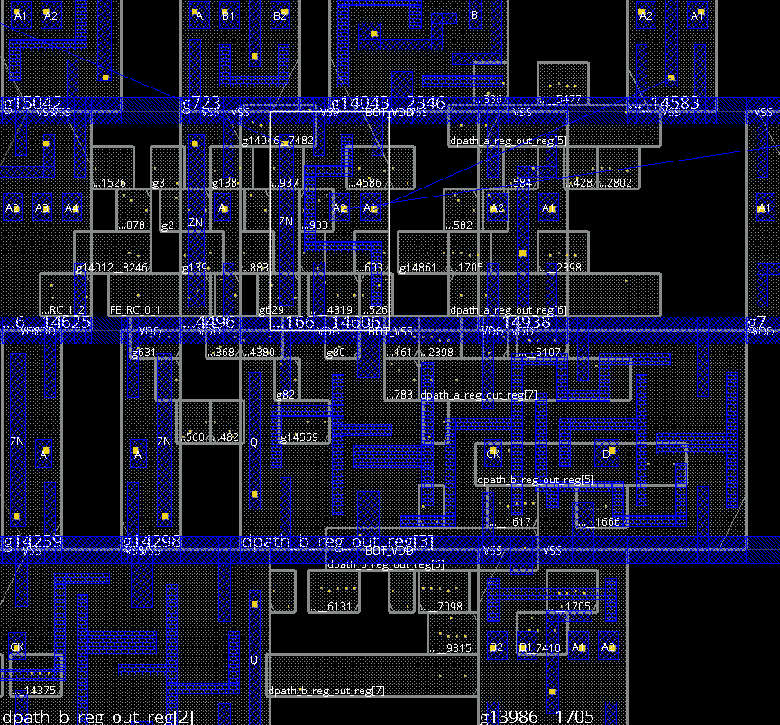
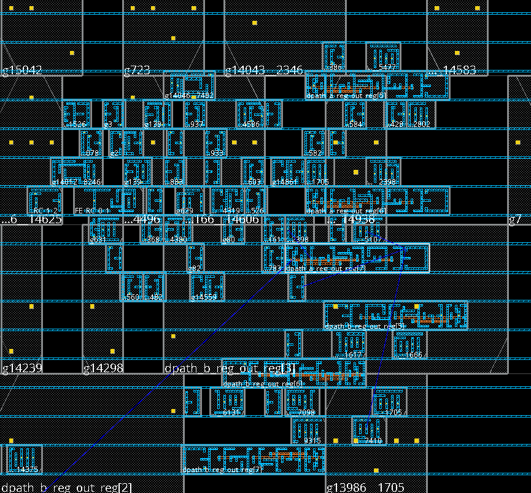
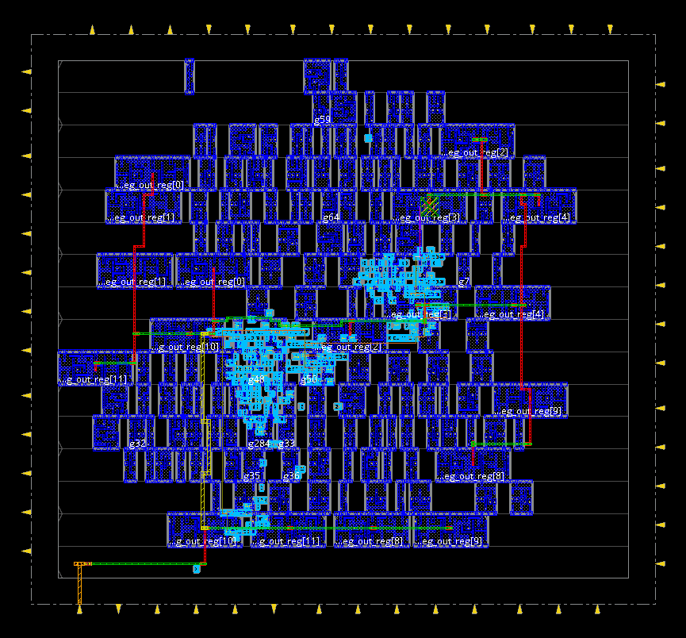
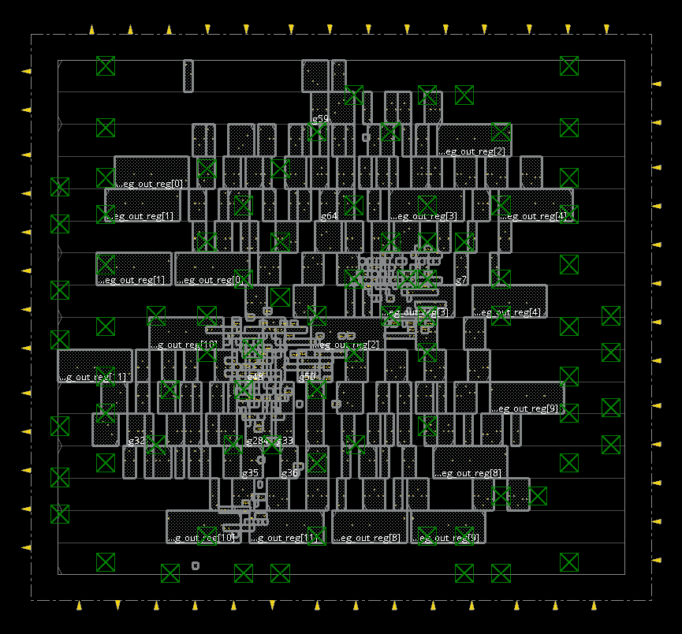
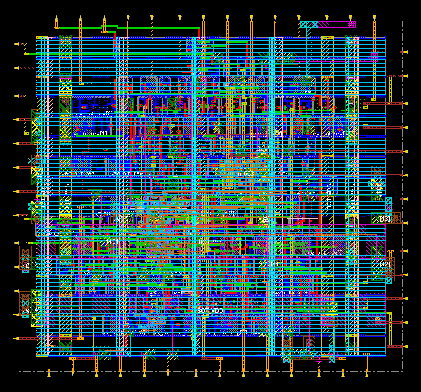
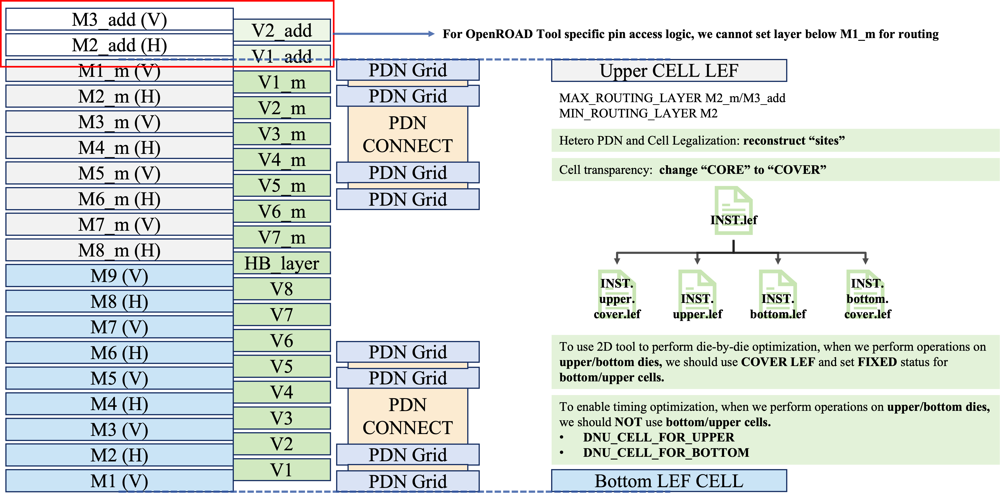
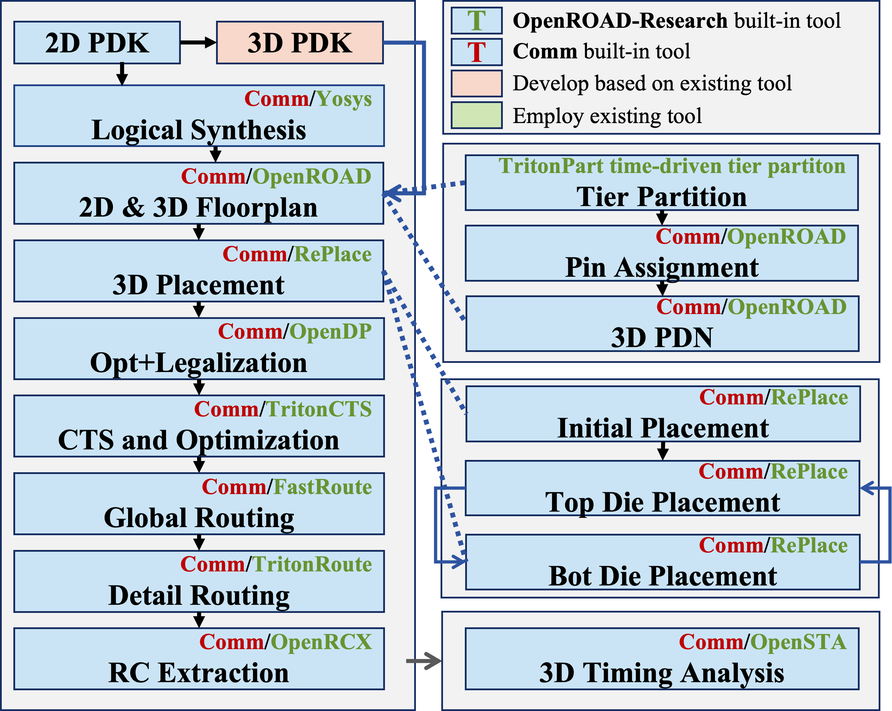

# Taiwei-3D-Eval

Taiwei-3D-Eval is an end-to-end reproducible physical design (PD) flow for face-to-face 3D ICs,
which leverages Pin3D methodology and mature 2D physical design tools (ORFS and Cadence tools) for high-quality 3D IC implementation.
Our flow allows academic researchers to validate and compare their 3D point tools in a full flow context.

## [Quick Start](#quick-start)

### Supported Tools
- **Open-source PD tools**: [ORFS-Research](https://github.com/ieee-ceda-datc/ORFS-Research) (ORD)
  - **Tested commit**: `bd2904522e3a26d50f08ffbcb8a0c6017cc48ebd`
  - Other versions may work but have not been fully validated. If you encounter issues, please open a GitHub issue in this repository.
  - Note: the branch used in the paper differs from the public release; please use the commit above for reproducibility.
- **Commercial PD tools**: Cadence tool suite (CDS)
  - Innovus `v21.39`
  - Genus `v21.39`

### Environment Setup

- Install **ORFS-Research** first by following the instructions in its repository.
- Update the paths in `env.sh` before running the flow:
  - `WORK_DIR`: Working directory (defaults to the current path)
  - `ORFS_DIR`: Installation directory of **ORFS-Research**
  - `FLOW_HOME`: Root directory of **TaiWei-Pin-3D**
- Make sure to source the environment script in every new shell before launching the flow:

```bash
source env.sh
```

### Example 1: Run the open-source flow for GCD design (3D stack setting:  ASAP7 + ASAP7)
```bash
# Run open-source flow for the AES design (3D stack setting:  ASAP7 + ASAP7)
python3 run_experiments.py --flow ord --tech asap7_3D --case gcd
```

### Example 2: Run the commerical flow for GCD design (3D stack setting:  ASAP7 + NanGate45)
```bash
# Run open-source flow for the AES design (3D stack setting:  ASAP7 + NanGate45)
python3 run_experiments.py --flow cds --tech asap7_nangate45_3D --case gcd 
```
After running above command (ASASP7-NanGate45-GCD), you can visualize chip layouts using OpenROAD's or Innovus's GUI.

### Example 3: Run the end-to-end flow for the GCD design using the provided bash script (3D stack setting: ASAP7 + NanGate45)
```bash
bash experiment_scripts/gcd.sh
```

<p align="center">
<table align="center" width="90%">
  <tr>
    <td align="center">
      
      <br>
      <em>(a) Bottom-tier PDN grid</em>
    </td>
    <td align="center">
      
      <br>
      <em>(b) Top-tier PDN grid</em>
    </td>
  </tr>

  <tr>
    <td align="center">
      
      <br>
      <em>(c) Bottom-tier standard-cell placement</em>
    </td>
    <td align="center">
      
      <br>
      <em>(d) Top-tier standard-cell placement</em>
    </td>
  </tr>

  <tr>
    <td align="center">
      
      <br>
      <em>(e) Clock tree synthesis (CTS)</em>
    </td>
    <td align="center">
      
      <br>
      <em>(f) Signal net routing</em>
    </td>
  </tr>

  <tr>
    <td align="center">
      
      <br>
      <em>(g) HBTs assigned by the router</em>
    </td>
    <td align="center">
      
      <br>
      <em>(h) Final 3D layout</em>
    </td>
  </tr>
</table>


</p>


## [Enablements](#enablements)
PDK (Process Design Kit) preparation is a foundational component of a robust 3D physical design flow. 
In this repository, we open-source three representative 3D stacking configurations derived from the NanGate45 and ASAP7 platforms in OpenROAD-flow-scripts:
- NanGate45-NanGate45 
- ASAP7-ASAP7
- NanGate45-ASAP7
These configurations cover both **homogeneous** and **heterogeneous** technology stacks and are suitable for benchmarking, algorithm development, and flow validation.


### Example: Build your own 3D PDK 
To illustrate the enablement methodology, we use the **ASAP7–ASAP7** configuration as a representative example. Starting from the standard 2D ASAP7 PDK, we derive a 3D-capable PDK by systematically extending the technology and library views.


- **Face-to-Face (F2F) Stack Modeling**: we model a **face-to-face (F2F)** stack by (i) replicating the original 2D metal stack on each tier, and (ii) introducing a **dedicated cut layer** to represent **hybrid bonding terminals (HBTs)** as vertical vias between tiers. Since the two dies in an F2F configuration are fabricated independently prior to bonding, we implement **symmetric yet electrically isolated power delivery networks (PDNs)** on the top and bottom tiers. This enables independent power supplies and voltage domains, which is essential for modeling heterogeneous 3D integration scenarios.

- **3D Standard-Cell Library Enablement**: we derive **tier-specific standard-cell libraries** from the base 2D library: (i) for each logical cell, we generate two physical LEF masters, where `*_bottom*` is used for the bottom tier and `*_upper*` for the top tier, and (ii) metal layers in each LEF are reassigned to the corresponding tier-local metal stack.

- **Die by Die Optimization**: we provide **COVER LEF** views for both tiers to enable die by die optimization. These views act as physical abstractions that: (i) exclude the inactive tier from overlap, density and congestion calculations, and (ii) preserve cross-tier connectivity and logical correctness.

This enablement strategy allows existing 2D physical design engines to operate on 3D designs with minimal modification, while retaining sufficient fidelity for meaningful tool and algorithm evaluation.


<p align="center">
  
  <br>
  <em>Figure: Metal stack, PDN strategy, and tier abstraction in the 3D ASAP7 PDK.</em>
</p>


## [Implementaion Flows](#implementation-flow)
Our 3D IC implementation flow highlights three key features:
- *Unified 2D technology abstraction for F2F 3D IC*: we model HBTs as special vias in an extended 2D metal stack, enabling unmodified 2D routers to realize cross-tier connections.

- *Iterative tier-by-tier optimization and legalization with 2D placers*: we alternate placement optimization between tiers using **COVER** views, with tier-aware legalization to enforce tier-specific sites and masters for homogeneous and heterogeneous stacks.

- *End-to-end 3D reference flow with hybrid toolchain support*: a unified scripting interface runs the RTL-to-GDS flow using OpenROAD, commercial tools, or mixed toolchains. Stage-wise checkpoints and METRICS2.1-compatible reports are exported to enable consistent, reproducible measurement.


The following figure presents an overview of our homogeneous and
heterogeneous Pin-3D physical design flow. The flow comprises following key stages:
- **Synthesis and 2D abstraction**: RTL is synthesized into a flat
gate-level netlist using a common logical library, which is later mapped to
tier-specific physical libraries for heterogeneous designs.

- **Partitioning and 3D floorplanning**: An initial 2D floorplan
undergoes timing-driven bipartitioning~\cite{zhiang_tritonpart_2023} to assign
cells to tiers. The design is then translated into tier-aware 3D views with
independent power delivery networks.

- **Iterative 3D placement**: Placement refinement begins from a global 2D placement and proceeds through a
die-by-die iterative optimization process.
One tier is fixed while the other is optimized for timing and congestion, followed by legalization.

- **3D clock tree synthesis (CTS)**: The clock tree is built on the
bottom tier. Top-tier sinks connect to this tree through inter-tier vias,
leveraging the unified 2D representation for vertical connectivity.

- **3D routing and optimization**: Routing utilizes the full metal
stack, modeling hybrid bonding terminals as special vias. Parasitics are then
extracted to drive post-route timing and power closure.

- **Metrics collection**: The flow records runtime, memory, timing,
power, wirelength, congestion, and violations (DRVs/FEPs) in a structured
format for both open-source and commercial reference flows.

<p align="center">
  
</p>

### [Stage-by-Stage](#Stage-by-Stage)

> The rows below mirror your **actual bash pipelines** (`test/aes/ord/run.sh` and `test/aes/cds/run.sh`). Targets that consume specific configs are annotated.

| Stage                   | OpenROAD target            | Cadence target             | Notes                                                        |
| :---------------------- | :------------------------- | :------------------------- | :----------------------------------------------------------- |
| **Clean**               | `clean_all`                | `clean_all`                | Remove `results/ reports/ logs/ objects/`.                   |
| **2D Synthesis**        | `ord-synth`                | `cds-synth`                | RTL → gate with 2D PDK. *(Uses `config2d.mk`)*               |
| **2D Pre‑place**        | `ord-preplace`             | `cds-preplace`             | Floorplan/IO staging for partitioning. *(Uses `config2d.mk`)* |
| **Tier Partition**      | `ord-tier-partition`       | `cds-tier-partition`       | Split into upper/bottom tiers. *(Uses `config2d.mk`)*        |
| **3D Prep (views)**     | `ord-pre`                  | `cds-pre`                  | Generate 3D views / import partition artifacts. *(Uses `config.mk`)* |
| **3D PDN**              | `ord-3d-pdn`               | `cds-3d-pdn`               | Unified PDN. *(Uses `config.mk`)*                            |
| **Place Init**          | `ord-place-init`           | `cds-place-init`           | Initialize cross‑tier placement. *(Uses `config.mk`)*        |
| **Place — Upper Tier**  | `ord-place-upper`          | `cds-place-upper`          | Alternate with bottom for `iteration` loops. *(Uses `config_bottom_cover.mk`)* |
| **Place — Bottom Tier** | `ord-place-bottom`         | `cds-place-bottom`         | Alternating cross‑tier refinement. *(Uses `config_upper_cover.mk`)* |
| **Place Finish**        | `ord-pre_cts`              | `cds-place-finish`         | Refinement. *(Uses `config.mk`)*                             |
| **Legalize — Upper**    | `ord-legalize-upper`       | `cds-legalize-upper`       | Legalize upper tier. *(Uses `config_bottom_cover.mk`)*       |
| **Legalize — Bottom**   | `ord-legalize-bottom`      | `cds-legalize-bottom`      | Legalize bottom tier and merge. *(Uses `config_upper_cover.mk`)* |
| **CTS**                 | `ord-cts`                  | `cds-cts`                  | Clock trees per die with cross‑die alignment. *(Uses `config.mk`)* |
| **Route (3D)**          | `ord-route`                | `cds-route`                | Detailed routing and create HBT vias. (Uses `config.mk`)*    |
| **Final / Reports**     | `ord-final`                | `cds-final`                | Report collation. *(Uses `config.mk`)*                       |
| **Thermal / Hotspot**   | `ord-hotspot`              |                            | Reuses OpenROAD HotSpot harness.                             |

### [Outputs](#Outputs)

After runs, you will typically see:

```
results/    # DEF/ODB/LEF/SPEF/GDS, etc.
reports/    # timing/power/HPWL/congestion/clock, etc.
logs/       # tool logs (OpenROAD/Cadence), final summary, plots
objects/    # intermediate DBs and caches
```

## Contacts
We welcome feedback, suggestions and contributions that help improve this repository, including enhanced materials, bug fixes and extensions. Please feel free to reach out via email, GitHub Issues or Pull Requests. Contact information for the maintainers is listed below.
*   **Zhiang Wang** — [zhiangwang@fudan.edu.cn](mailto:zhiangwang@fudan.edu.cn)
*   **Zhiyu Zheng** — [zyzheng24@m.fudan.edu.cn](mailto:zyzheng24@m.fudan.edu.cn)


Before using this repository, please carefully review the header notices in all TCL scripts that invoke commercial EDA tools.
We gratefully acknowledge Cadence and Synopsys for permitting, in an academic research context, the inclusion of limited excerpts of their copyrighted intellectual property for researchers’ use.

If your research, products or publications benefit from this repository, we kindly ask that you cite the relevant papers listed below.


## References
[1] L. Jiang, A. B. Kahng, Z. Wang*, Z. Zheng, "Invited: Toward Sustainable and Transparent Benchmarking for Academic Physical Design Research", Proc. ISPD, 2026.


